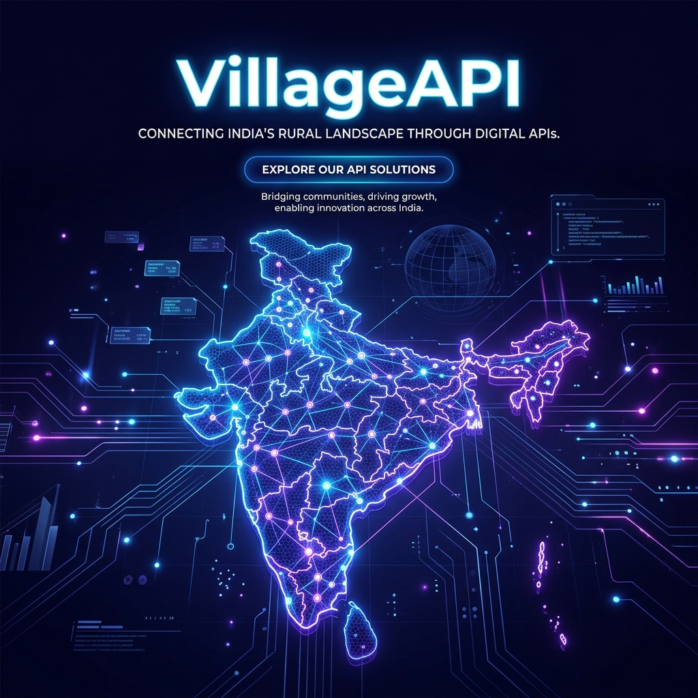
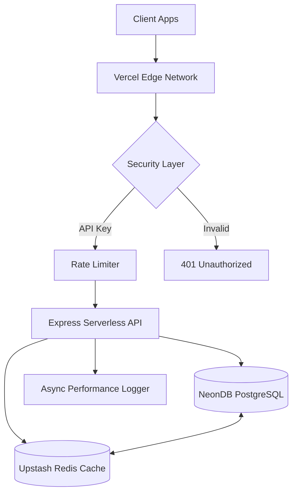

<div align="center">
  
  
  # VillageAPI
  ### The Definitive Geographical Engine for India's Rural Data
  
  [](https://nodejs.org)
  [](https://typescriptlang.org)
  [](https://neon.tech)
  [](https://upstash.com)
  [](https://vercel.com)

  **VillageAPI** is a high-performance, production-grade B2B SaaS platform providing instantaneous REST API access to India's complete hierarchical geographical data — covering over **619,000 villages**.
</div>

---

## 🚀 Key Highlights

*   **Lightning Fast Search**: Sub-100ms fuzzy matching using PostgreSQL GIN Trigram indexing.
*   **Massive Scale**: Fully indexed dataset of 619,226 villages, 616 districts, and 6,381 sub-districts.
*   **B2B Architecture**: Built-in API key management, multi-tier rate limiting, and real-time performance logging.
*   **MDDS Verified**: All data is cross-referenced with the Government of India's MDDS (Metadata and Data Standards) 2011 directory.
*   **Modern UX**: Premium dashboard and landing page with Dark Mode, Glassmorphism, and smooth Framer Motion animations.

---

## 🏗️ System Architecture

VillageAPI utilizes a serverless-first architecture optimized for low-latency global delivery.



---

## 💻 Tech Stack & rationale

| Component | Technology | Rationale |
| :--- | :--- | :--- |
| **Orchestration** | [Turborepo](https://turbo.build/) | Atomic builds, shared types, and highly efficient monorepo management. |
| **Database** | [NeonDB](https://neon.tech/) | Serverless Postgres with auto-scaling and branching support for ETL. |
| **ORM** | [Prisma](https://www.prisma.io/) | Full type-safety across the stack and seamless migration management. |
| **Cache & Rate Limit** | [Upstash Redis](https://upstash.com/) | Low-latency caching with a serverless-ready REST API. |
| **Frontend** | [React 19](https://react.dev/) | Utilizing the latest React features and Framer Motion for premium UX. |

---

## 📊 Data Coverage (Verified MDDS 2011)

VillageAPI offers complete coverage of India's administrative hierarchy.

| Entity | Count | Verified Status |
| :--- | :---: | :---: |
| **States & UTs** | 30 | ✅ |
| **Districts** | 616 | ✅ |
| **Sub-districts** | 6,381 | ✅ |
| **Villages** | 619,226 | ✅ |

---

## 🛠️ Developer Integration

Integrate VillageAPI into your stack in minutes.

### 1. Fuzzy Search
```bash
curl -H "X-API-KEY: your_key" \
     -H "X-API-SECRET: your_secret" \
     "https://api.villageapi.in/v1/search?q=Arrod"
```

### 2. Response Schema
```json
{
  "id": "2f6ba9e9-4c2f-4415-a489-953367e26220",
  "name": "Arrod",
  "state": "MADHYA PRADESH",
  "district": "Sheopur",
  "subDistrict": "Vijaypur",
  "mddsPlcn": "451361",
  "score": 1.5
}
```

---

## 🏎️ Performance Benchmarks

| Endpoint | Average Latency | Reliability (SLA) |
| :--- | :---: | :---: |
| `/v1/search` | **85ms** | 99.9% |
| `/v1/states` | **12ms** | 99.99% |
| `/v1/districts` | **25ms** | 99.9% |

---

## 👨‍💻 Quick Start for Developers

1. **Clone & Install**:
   ```bash
   git clone https://github.com/Rxhulnxyak/Village-API-Platform.git
   npm install
   ```
2. **Environment Setup**:
   Copy `.env.example` to `.env` and fill in your NeonDB and Upstash credentials.
3. **Run Dev**:
   ```bash
   npm run dev
   ```

---

<div align="center">
  <p>Built with ❤️ by <strong>Rxhulnxyak</strong></p>
  <p>Powered by <strong>VillageAPI Platform</strong> · India's Geography Engine 2026</p>
</div>
